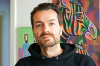

 

## Philipp Schreiber, Cologne, Germany, Europe, Earth  
Seasoned (14 years industry, 42 years age) software developer with strong product development and lead skills. Background in ecommerce, b2b and b2c service implementation and operation. Broad stack of technology. Pragmatic approach. Thorough experience in hands-on web-development. Mostly CRUD applications of various sorts and sizes. Meddling in product management a lot, mostly advisory, sometimes annoyingly so. 
Also thorough experience in keeping shit from fellow devs, getting them appreciation and giving them space to tackle challenges, gather new experiences, making the most of their abilities (otherwise known as management or leadership). Totally comfortable not to be the smartest or most knowledgable in any given room of devs, quite on the contrary.   
Since 2015 my priority #1 is my daughter.

Let's talk: __<philipp@schreiber-entwicklung.de>__

---
## Professional Experience: 

### Head of Software Development
__Justix GmbH__  
__Nov. 2019–today__  
__Köln, Germany__  

Idea, concept, strategy, realization, people... the whole deal. Still coding. Key aspect at justix is probing legal tech market with greenfield products. Strategy is to establishing platform fundamentals to allow quick go to market. Weapons of choice are lightweight backends written in PHP, symfony and API-platform around which several logic heavy frontends in react.js and vuejs create various experiences like B2B2C legal document assembly tools or the swiss army knife of access to justice at [HelloLaw](https://de.hellolaw.com).

---
### Senior Software Developer/ Interim Domain Lead
__real.digital__  
__Sept. 2017–Oct. 2019 · 2 Jahre 2 Monate__  
__Köln, Germany__  

Building (planning, designing software architecture, staffing, testing, implementing) customer service tech components. Ranges from customer and agent facing case management software over searchable knowledge bases, tracking solutions to customer account tools. PHP, vuejs, graphql and MySql are prevalent, but there is also MongoDB, RabbitMQ, Go, Docker, K8s, Elastic, Kafka and a lot of other stuff in the mix. Running up to 14 people cross functional team. Powering customer as well as backoffice facing services for one of Europe's largest ecommerce platforms [real](https://real.de)

---
### Senior Software Engineer
__Saloodo!__  
__July 2017–Sept. 2017__  
__Köln, Germany__  
DHL digital freight platform startup. As first saloodo inhouse developer responsible for kicking off the transition from an incubated software to being maintained inhouse. As short-lived as this excursion was, it still yielded my first professional experience in react.js as well as solidifying symfony skills.

---

### Senior Web Engineer
__Koelnmesse GmbH__  
__Mar. 2017–June 2017__  
__Köln, Germany__  
Technical project and product management. Mostly managing external service providers. Bootstrapping an unified authentication system, IAM, SSO.

---

### Senior Web-Developer
__Denkfabrik Groupcom GmbH__  
__Feb. 2013–Feb. 2017__  
__Hürth, Germany__  

Full service agency. Mostly long running B2B websites and software projects. Very universalist approach and mostly one-man-show projects involving full customer facing responsibilty. Most memorably single handedly created an unity3d AR application in C#. Another interesting project was the backend to a weather app pulling all data nationwide and pushing out weather alerts to all subscribers. A lot of TYPO3 websites. At that point I also still created designs in photoshop.

### CTO
__IQ Professionals Institute GmbH__
__Feb. 2011–Feb. 2013__
__Hürth, Germany__  

denkfabrik spin off start up. Full responsibility for product and technical development of a recruitment platform around early stage remote candidate qualification.

### Web-Developer
__Denkfabrik Groupcom GmbH__  
__Jan. 2010–Jan. 2011__  
__Hürth, Germany__  

Full service agency. Mostly long running B2B websites and software projects. Mostly TYPO3 websites. LAMP, jQuery, js.

### Trainee Web-Development
__Denkfabrik Groupcom GmbH__  
__Jan. 2008–Dez. 2009__  
__Hürth, Germany__  

Acquring the fundamentals of web-development in the age of IE5, mostly on LAMP stack, HTML, CSS, some JS. TYPO3 with configuration language typoscript. On the job training. A lot of learning by doing. 

---

### Online-editor
__ARMEDANGELS/Social Fashion Company__  
__July 2007-Dez 2007__  
__Köln, Germany__   

Early stage fair fashion startup. I ran the blog and connected to the bloggosphere, which was still en vogue at the time. Also involved in everything operationally, meaning taking orders, packaging them, sending them out, processing returns...

---
## Education:

### Governmental Teacher Trainee
__Konrad-Adenauer-Gymnasium__  
__Feb 2007-June 2007__  
__Langenfeld, Germany__   

Teaching English and German in the German university-qualifying highschool track (Gymnasium). 
The logical step after graduating from University with the "1. Staatsexamen für die Lehrämter Sekundarstufe II und I". High school teaching just wasn't for me. So I pivoted as early as possible.

----

### 1. Staatsexamen für die Lehrämter Sekundarstufe II und I, Germanistik, Anglistik, Erziehungswissenschaften (M.Ed.)
__Universität zu Köln__  
__2000-2006__  
__Köln, Germany__   

Full academic degree in German and English and educational sciences as minor. Equivalent to Master of Education. Governmental teaching track, which results in a state exam. So, yes, my completed formal education is in the humanities.

I did take a few CS courses at Feruniversität Hagen from 2013 to 2015 for a Master in applied cs, but did not continue after the birth of my daughter.